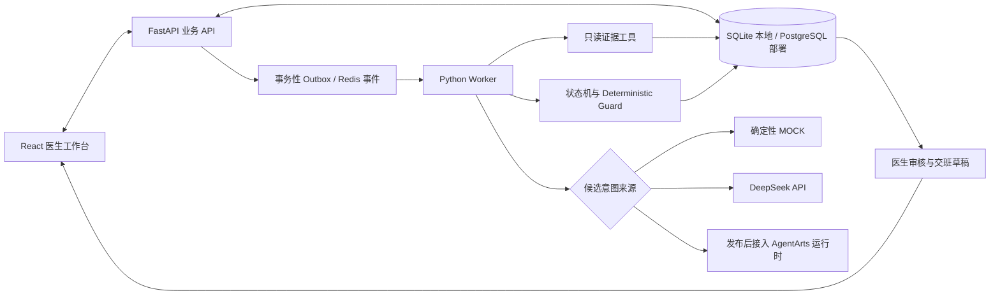

# ClinLoop · 临床工作流连续性 Agent

[](https://github.com/legend91019/ClinLoop/actions/workflows/ci.yml)
[](https://github.com/legend91019/ClinLoop/actions/workflows/security.yml)

ClinLoop 把医生提出的随访意图变成可追踪的任务：记录需要等待什么结果、核对结果来自哪里、提醒医生审核尚未闭环的事项，并把未完成任务带入交班草稿。它面向**华为 ICT 创新赛 AI 方向的 AgentArts 赛题**，当前以合成病例展示检验结果随访场景。

> **项目状态（2026-10-08）：可本地体验的工程原型；AgentArts 画布已试运行，云端运行时和完整平台测评尚未完成。** 所有示例使用合成数据。项目不提供诊断、治疗建议或自动医嘱；现有测评不能证明临床有效性或实际节时。


[查看完整医生工作台](docs/development/screenshots/doctor-console.jpg) · [查看交班草稿](docs/development/screenshots/handoff-sealed.jpg)。截图来自本地合成病例演示，不是 AgentArts 云端部署。

## 从一条查房记录到一次交班

```text
查房记录：血培养结果出来后通知我
    ↓ Agent 识别 FOLLOW_RESULT，建立等待检验结果的 Open Loop
血培养结果到达
    ↓ Agent 调用只读工具，匹配患者、就诊、项目和结果来源
生成带证据引用的待审核 Finding
    ↓ 医生查看原始记录并接受或驳回
医生确认后继续等待药敏结果
    ↓ 新结果唤醒依赖 Loop
交班草稿汇总仍未闭环的高优先级任务
```

Agent 负责理解文本意图、规划只读检索、核对证据并提出候选变化。**Deterministic Guard** 负责患者归属、状态转换、证据约束和审核边界；Agent 的输出不会直接修改正式病历或替医生作出高风险决定。运行轨迹保留模型来源、工具调用、停止原因和审计记录。

### 当前实现

| 部分 | 已实现的范围 |
| --- | --- |
| 医生工作台 | 患者时间线、未闭环任务、流程缺口、原始证据抽屉、Agent 轨迹、医生审核、交班草稿。 |
| 在线 Worker | 事件驱动处理，意图与 Loop 的暂停、唤醒和重规划；检验结果关联及医生确认后的药敏依赖任务。 |
| 模型接入 | 默认确定性 `mock` 演示；可选 DeepSeek 实际推理；已实现调用已发布 AgentArts 运行时的适配器。 |
| 工具与安全 | 只读工具白名单、患者和就诊隔离、步数与超时限制、证据来源校验、失败保守退出。 |
| 测评 | 固定 6 例和 50 例合成在线 Worker 评测、100 条合成轨迹离线回放、人工计时分析脚本。 |

当前在线验收重点是 **`RESULT_WITHOUT_ACKNOWLEDGEMENT`**。其他流程缺口类别已有领域契约和离线样本，尚未达到同等程度的在线 Agent 验证。没有真实 EHR 接入、生产身份认证或多 Worker 并发部署。

## 快速启动本地演示（Windows PowerShell，无需 Docker）

需要 Python 3.12+、Node.js 22+ 和 `uv`。在仓库根目录执行：

```powershell
git clone https://github.com/legend91019/ClinLoop.git
cd ClinLoop
uv sync --group dev
npm --prefix apps/web ci
$env:DATABASE_URL = "sqlite+pysqlite:///clinloop-local.sqlite3"
uv run python scripts/init_local_trial.py
```

再打开三个 PowerShell 终端，**都进入同一个仓库目录，并使用同一个 SQLite 文件名**：

```powershell
# 终端 1：业务 API
$env:DATABASE_URL = "sqlite+pysqlite:///clinloop-local.sqlite3"
$env:EVENT_BUS = "database"
uv run uvicorn apps.api.app.main:app --host 127.0.0.1 --port 8000
```

```powershell
# 终端 2：Worker；mock 是确定性演示，不调用大模型
$env:DATABASE_URL = "sqlite+pysqlite:///clinloop-local.sqlite3"
$env:EVENT_BUS = "database"
$env:AGENT_PROVIDER = "mock"
uv run python scripts/run_worker.py
```

```powershell
# 终端 3：医生工作台
$env:VITE_API_BASE_URL = "http://127.0.0.1:8000"
npm --prefix apps/web run dev -- --host 127.0.0.1
```

打开 [医生工作台](http://127.0.0.1:5173/?patient=P-1001)，在“试用 Agent 事件链”中依次发送**查房记录 → 血培养结果 → 医生确认 → 药敏结果**，观察任务、证据、待审核缺口和 Agent 轨迹。API 文档在 [Swagger](http://127.0.0.1:8000/docs)。已有数据库不会被初始化命令清空；要重走空白病例，请换一个新的 SQLite 文件名。

使用真实 DeepSeek 模型时，按[本地试用指南](docs/development/deepseek-agent-trial.md)在 **Worker 终端**安全输入新密钥并把 `AGENT_PROVIDER` 改为 `deepseek`。模型 API 可能计费；曾在聊天中发送的密钥应撤销并更换。PostgreSQL / Redis 和固定种子 Demo 见[演示手册](docs/demo/runbook.md)。

## 系统结构



仓库中的 `apps/mcp_server` 实现本地只读工具注册和适配；当前 AgentArts 画布**尚未连接已部署的云端 MCP 服务**。目录分别承担以下职责：

| 路径 | 职责 |
| --- | --- |
| `apps/web`、`apps/api` | 医生工作台、REST API、持久化与审核接口。 |
| `apps/worker`、`apps/mcp_server` | 事件处理、Agent、模型适配和只读工具。 |
| `packages/contracts`、`packages/domain` | 共享契约、状态机、Guard 和领域规则。 |
| `packages/fixtures`、`eval` | 合成病例、回放、基线、在线评测与指标。 |

## 已取得的测评证据

下表区分**完整 Worker 告警**与**平台画布候选意图**，不能把两者混算。报告只使用合成病例，标签与模型输入分离；失败病例保留在分母中。

| 测评 | 对象与样本 | 结果 | 能证明什么 |
| --- | --- | --- | --- |
| [固定 50 例规则基线](artifacts/eval/contest-rules-report.json) | `contest-v1`，25 阳性 + 25 阴性；生产 Worker 的无模型规则提取器 | TP 19 / FN 6 / FP 0 / TN 25；召回率 **76%**、精确率 **100%**、阴性误报率 **0%** | 在这组固定合成病例上，规则可检出 19 个带来源的告警；仍漏掉 6 个。 |
| [6 例在线回归](artifacts/eval/online-report.json) | `smoke-v1`，生产 Worker；规则与确定性 MOCK 分别运行 | 规则：TP 2 / FN 1 / FP 0 / TN 3。MOCK：TP 3 / FN 0 / FP 1 / TN 2 | 验证数据库持久化、工具与证据链；MOCK 不是 LLM 效果。 |
| [AgentArts 免费试运行](docs/agentarts/free-trial-evidence-2026-10-08.md) | 冻结集 1 阳性 + 1 阴性；知识检索 + 两个模型节点 | 阳性输出 `FOLLOW_RESULT`（17.90 秒）；阴性输出 `null`（22.03 秒） | 两例候选意图符合预期；未经过发布运行时和完整 Worker，**不能计算 50 例召回率**。 |
| [100 条离线轨迹](artifacts/eval/report.json) | 固定 seed 的流程缺口生成与回放 | 已生成可复现的工程报告 | 用于检查契约、时序、证据和指标实现；默认模型行是模拟，不代表真实模型性能。 |

复现固定 50 例规则基线：

```powershell
uv run python -m eval.run_online_eval --provider rules --corpus contest-v1 --output artifacts/eval/contest-rules-local.json
```

`contest-v1` 的语料 SHA-256 为 `b8780d14be703102e22c196706308a279e030ca2a4eb24d73d21b507f21dcd90`。评测协议预设的 AgentArts 目标是：**25 个阳性至少检出 24 个**（召回率 ≥95%），精确率 ≥90%，25 个阴性最多误报 2 个，发出的证据引用有效率 100%。**这是验收目标，不是现有成绩。**指标定义、失败处理和命令见[评测说明](eval/README.md)与[AgentArts 评测协议](docs/agentarts/evaluation-protocol.md)。

目前没有已发布 AgentArts 运行时的 50 例完整链路报告，也没有真实参与者的配对计时数据。因此尚不能宣称 AgentArts 达到 95% 召回，或证明 ClinLoop 减少了医院病例管理时间。人工实验模板和分析器已准备好，但观察数据必须由实际参与者产生。

## AgentArts 参赛进度

平台区域为**西南-贵阳一**。当前已建立 `ClinLoop-Result-Followup-v1` 任务型工作流，串联 SOP 知识检索、意图提案模型和证据复核模型；另有多智能体控制器草稿。两例免费画布试运行已成功。画布配置、输入契约及部署步骤见[AgentArts 手册](docs/agentarts/workflow-runbook.md)。

正式提交前仍需完成：发布运行时并接入本地 Worker；验证平台只读工具调用及多智能体路由；在固定集上跑完整 50 例；开展真实参与者节时实验；提供在线 Demo 与演示材料。当前账号在 2026-10-08 显示评测实验免费次数 `0/0`，正式部署的模型调用存在按量计费风险；本阶段仅使用免费试运行额度，没有启动可能收费的评测任务或部署。

## 安全边界与开发约定

- **只使用合成数据**；不要上传真实患者记录、密钥、`.env`、数据库文件或卷。
- Agent 不开立、修改或停止医嘱，不做诊断或治疗建议。缺少记录只表述为“已搜索来源中未找到”。
- Finding 必须保留证据引用和搜索来源；患者、就诊、检验项目与时间边界由确定性逻辑复核。
- 医生接受或驳回只追加审计记录；高风险任务不会因模型输出而自动关闭。
- `main` 是集成分支。改动经分支、PR、CI 检查后 squash merge；不要直接推送 `main`。

本地发布检查运行 `uv run python scripts/verify_release.py`；GitHub Actions 同时检查后端、前端、密钥和禁止提交的产物。更多材料：[架构图](docs/architecture/system-overview.mmd) · [医生工作台说明](docs/development/doctor-console-evaluation.md) · [演示步骤](docs/demo/runbook.md) · [发布清单](docs/release/mvp-checklist.md)。
