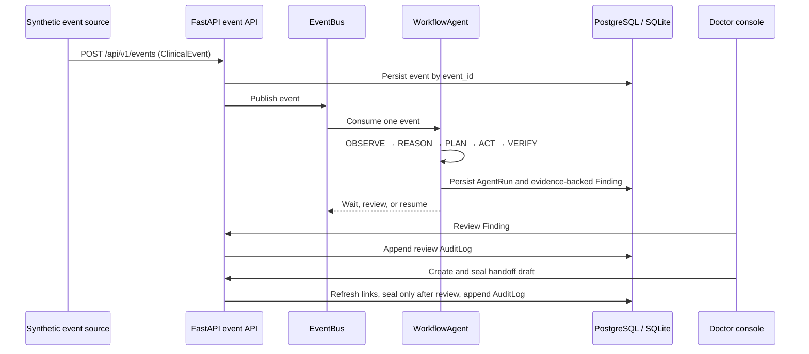

# ClinLoop runtime sequence

The MVP runtime keeps the write boundary explicit:



## Canonical demo

`packages/fixtures/cases.py` defines one fully synthetic trajectory for
`P-1001`:

1. `NOTE_CREATED` records the `FOLLOW_RESULT` intent and leaves a result loop
   open.
2. `LAB_RESULT_CREATED` resumes the result loop and records a
   `RESULT_WITHOUT_ACKNOWLEDGEMENT` finding tied to `LAB-8821`.
3. `PROGRESS_NOTE_CREATED` resumes the dependency loop waiting for the
   susceptibility result.
4. `HANDOFF_STARTED` produces a draft containing the high-priority open loops.

The finding and loops remain open until a clinician review is recorded. The
demo then accepts the synthetic finding and seals the handoff, producing
`run`, `review`, and `seal` audit entries.

## Reproducible command

The command works against the configured `DATABASE_URL` and can also run
against a local SQLite file:

```powershell
python scripts/run_demo.py --patient P-1001
python scripts/run_demo.py --patient P-1001 --no-review
python scripts/run_demo.py --patient P-1001 --database-url sqlite+pysqlite:///demo.sqlite3
```

The final JSON object contains the event IDs, run IDs, loop IDs, evidence
backed findings, handoff ID and final action. Every input event and fixture ID
is stable; Agent and handoff IDs are generated per execution.

## Production wiring

The CLI uses `InMemoryEventBus` so it remains usable in a clean checkout.
Docker Compose supplies PostgreSQL and Redis for the API deployment. Replacing
the bus with `RedisStreamEventBus` does not change the event contracts or the
repository boundaries. The Worker never writes loop state directly: any
high-risk state change must go through the deterministic domain policy and
clinician review service.
