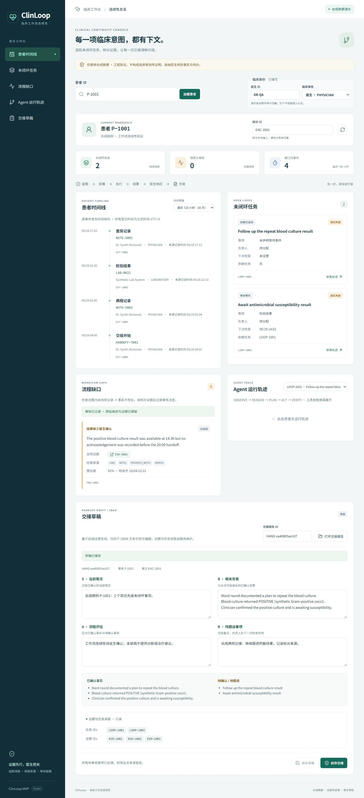
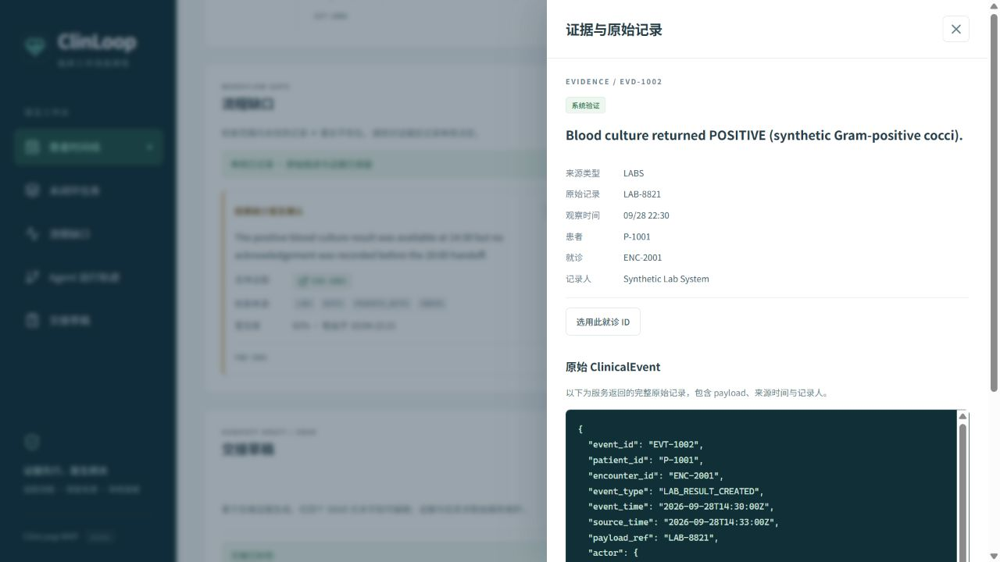
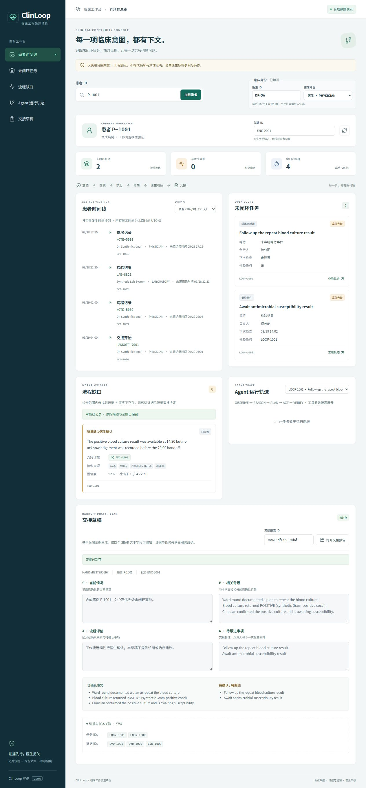

# 医生工作台与合成评测（task 9–11）

本模块只使用合成数据。工程验证，不构成临床有效性证明。医生工作台围绕患者任务与证据组织，不提供诊断、治疗或医嘱操作。

## 本地启动

需要 Python 3.12、Node 22、PostgreSQL 16 和 Redis 7。仓库根目录执行：

```powershell
Copy-Item .env.example .env
python -m pip install -e . --group dev
docker compose up -d postgres redis
python -m alembic upgrade head
python -m packages.fixtures.seed
python -m uvicorn apps.api.app.main:app --port 8000
```

另开终端启动医生端：

```powershell
npm --prefix apps/web ci
npm --prefix apps/web run dev
```

访问 `http://127.0.0.1:5173/?patient=P-1001`。默认 API 为 `http://localhost:8000`；可用前端环境变量 `VITE_API_BASE_URL` 覆盖。开发 API 默认只允许 localhost/127.0.0.1:5173 的跨域请求，部署时用 `CORS_ORIGINS` JSON 数组配置。

审核、保存和封存前明确输入合成医生身份。`X-Actor-Id` / `X-Actor-Role` 只是本地演示归属标识；真实部署仍需可信网关身份认证。创建交接前确认就诊 ID，例如种子患者 P-1001 对应 ENC-2001。接口会校验患者与就诊关系。

## 五个视图

- 患者时间线：事件时间、来源记录和产生者。
- 未闭环任务：状态、等待事件、负责人、下一次检查和依赖。
- 流程缺口：原始 claim、支持证据和搜索来源；医生接受或填写理由后驳回。
- Agent 轨迹：步骤、工具、原因、输出引用和停止原因；ACT 参数默认折叠。
- 交接草稿：已确认事实和待确认事项分开显示。仅四个 SBAR 文本字段可编辑；证据、Loop 关联和状态由服务端控制。

接受或驳回不会删除、改写原始 finding。封存存在服务端审核检查，草稿编辑写入追加式审计，已封存草稿拒绝编辑。切换患者时过期请求不能覆盖当前患者内容。

## 补齐的接口

| 接口 | 用途 |
|---|---|
| GET /api/v1/patients/{patient_id}/findings | 当前患者的 finding 列表 |
| GET /api/v1/evidence/{evidence_id}/source | 原始 ClinicalEvent，包括 payload；验证患者、就诊与来源，优先使用显式 provenance 指针 |
| GET /api/v1/handoff/{handoff_id} | 查询持久化草稿/封存文本 |
| PATCH /api/v1/handoff/{handoff_id} | 部分更新 situation/background/assessment/recommendation |

PATCH 拒绝空请求、null、未知字段与受保护的关联字段；非医生角色返回 403，未知草稿返回 404，非 DRAFT 返回 409。OpenAPI 随接口同步更新。

草稿事实按就诊隔离；旧证据缺少就诊字段时，使用原始事件恢复归属。草稿写操作使用状态与更新时间的原子条件更新，冲突返回 409，避免并发编辑覆盖封存报告。

封存时重新生成待办、已确认事实及关联列表，清除已接受／驳回事项的过时待审核标签，同时保留医生编辑的四个 SBAR 文本。归属未知的高风险待审核事项保守阻止封存。接受流程缺口不等同于确认临床事实。

## 评测与验证

```powershell
python -m eval.run_eval --count 100 --seed 20260928 --output artifacts/eval/report.json
python -m pytest -q
python -m ruff check .
python -m ruff format --check .
npm --prefix apps/web run test -- --run
npm --prefix apps/web run lint
npm --prefix apps/web run format:check
npm --prefix apps/web run build
```

100 条轨迹按 25 正常 / 20 Plan→Order / 20 Order→Execution / 20 Result→Response / 15 Evidence→Handoff 构成。固定 seed 保证重复生成；回放按时序逐步提供可见记录，方法不能读取真值标签。四个方法统一输出 finding 和 handoff prediction。

离线模型模拟与实际模型调用必须在报告中区分。默认无模型凭据时的结果只用于验证生成、回放、契约和指标；不能作为 LLM 或 RAG 的性能结论。ClinLoop 方法调用仓库现有 runtime，保留其真实限制，不能用真值替换其输出。

需要真实模型评测时，显式配置 `CLINLOOP_EVAL_ENDPOINT`（兼容 `/v1/chat/completions` 的完整地址）、`CLINLOOP_EVAL_MODEL`、`CLINLOOP_EVAL_API_KEY`，并指定 provider：

```powershell
python -m eval.run_eval --count 100 --seed 20260928 --provider eval.baselines.providers:real_http_provider --output artifacts/eval/real-report.json
```

只配置环境变量不会启用外部推理。服务需支持严格 JSON Schema 输出；失败会终止本次运行，不伪造预测。报告只记录公开模型名和调用元数据，不保存凭据、请求 prompt、私有 endpoint 或原始模型响应。真实模型评测的可重复性取决于模型版本与服务设置。本次验证只调用本地 HTTP 测试替身，没有发起付费推理。

指标同时提供分母计数；分母为零时按队长计划返回 0.0。证据覆盖要求来源有效、患者和事项匹配且在预测时刻可见，不以非空 evidence ID 代替来源验证。输出 artifacts、构建产物和本地数据库不提交。

Evidence Coverage 同时统计 finding 和交接条目，并单独给出两类覆盖率。误报分母为正常的患者/事项/断链类型机会，包括缺陷病例中未受影响的链路。该定义和计数均写入报告，便于复核，不能与病例级误报率混用。

本次分支只负责 task 9–11 与必要接口衔接。生产身份认证、多患者调度、真实医院连接及完整赛事集成验收仍按后续团队安排推进。

## 页面联调记录

使用隔离的 SQLite 合成数据库验证历史事件、原始检验记录、驳回理由必填、审核后保留原始 finding、草稿保存以及封存后文本锁定。Docker 不可用，因此本次没有验证 PostgreSQL / Redis 的部署联动。以下截图来自真实本地页面：






